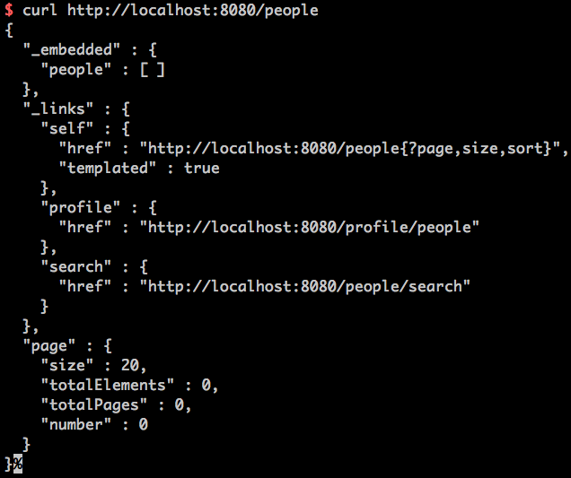
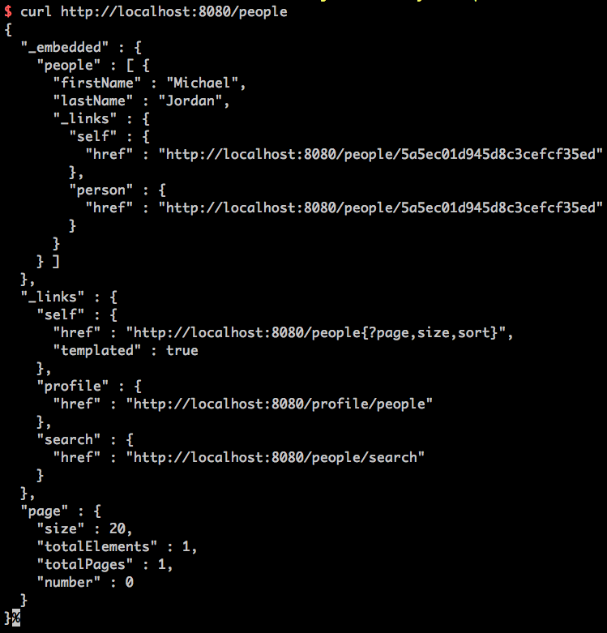

# RESTful API w/Spring Boot, Maven & MongoDB
###### git clone ➡ install & launch MongoDB ➡ run the application w/Maven

instructions for installing & launching MongoDB:
* brew install:
```
$ brew install mongodb
```
* launch the mongo daemon
```
$ mongod
```
* open another terminal window and launch the MongoDB client
```
$ mongo
```

run the application w/Maven
 ```
$ ./mvnw spring-boot:run 
```

For CRUD functionality refer to the below commands once the application is running

hit localhost:8080
```
$ curl http://localhost:8080
```


hit localhost:8080/people
```
$ curl http://localhost:8080/people
```


POST new name to MongoDB
```
$ curl -i -X POST -H "Content-Type:application/json" -d "{ \"firstName\": \"Michael\", \"lastName"\: \"Jordan\" }" 
http://localhost:8080/people
```


query all people to check that the POST worked
```
$ curl http://localhost:8080/people
```


OR hit the new MJ end-point to check that the POST worked
```
$ curl http://localhost:8080/people/5a5ec01d945d8c3cefcf35ed
```


find all custom queries
```
$ curl http://localhost:8080/people/search
```


to use findByLastName
```
$ curl http://localhost:8080/people/search/findByLastName?name=Jordan
```


PUT to change Michael Jordan entry to Ash Ketchum
```
$ curl -X PUT -H "Content-Type:application/json" -d "{ \"firstName\": \"Ash\", \"lastName\": \"Ketchum\" }"
```


PATCH to change Ash to Trainer
```
$ curl -X PATCH -H "Content-Type:application/json" -d "{ \"firstName\": \"Trainer\" }" http://localhost:8080/people/5a5ec01d945d8c3cefcf35ed
```


DELETE to change Ash to Trainer
```
$ curl -X DELETE http://localhost:8080/people/5a5ec01d945d8c3cefcf35ed
```


curl http://localhost:8080/people/5a5ec01d945d8c3cefcf35ed one more time to confirm the DELETE